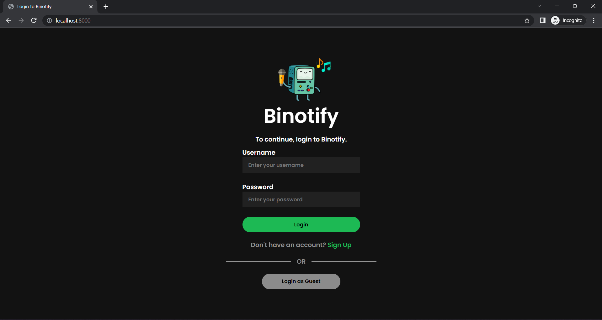

6. Buatlah file README yang berisi:
   - Deskripsi aplikasi web
   - Daftar requirement
   - Cara instalasi
   - Cara menjalankan server
   - Screenshot tampilan aplikasi (tidak perlu semua kasus, minimal 1 per halaman), dan
   - Penjelasan mengenai pembagian tugas masing-masing anggota (lihat formatnya pada bagian pembagian tugas).

# Deskripsi aplikasi web

Aplikasi ini adalah aplikasi web sederhana yang dapat digunakan untuk mendengar lagu serta melihat album dengan mengambil contoh dari Spotify. Aplikasi web ini dibuat dalam PHP, HTML, CSS, dan JS tanpa framework, dengan mengutilisasikan XHR sebagai Ajax. Database dari web ini terdapat di awan dengan menggunakan PostgreSQL. Aplikasi ini dibuat untuk memenuhi tugas besar mata kuliah Pemrograman Aplikasi Berbasis Web.

# Daftar requirement

# Cara instalasi

1. Clone repository ini
2. Install XAMPP or Docker

# Cara menjalankan server

### XAMPP

Pindahkan isi dari repository ini ke htdocs pada XAMPP. Konfigurasi database dapat dilihat pada config/.env .

### Docker

`docker compose up`

# Screenshot tampilan aplikasi

### Login Page

### Register Page

### Home Page

### Search, Sort, Filter Page

### Daftar Album Page

### Detail Album Page

### Detail Lagu Page

### Edit Album

### Edit Lagu

### Tambah Album

### Tambah Lagu

### Pembagian tugas

### Daftar User

### 404 Page

## Frontend / Client-side

13520016, 13520073

1. Login:
2. Register:
3. Home:
4. Daftar Album: 13520076
5. Search, Sort, Filter:
6. Detail Lagu:
7. Detail Album:
8. Edit Lagu:
9. Edit Album:
10. Tambah Album:
11. Tambah Lagu:
12. Daftar User:
13. 404 :
14. Navbar:
15. Responsive Adjustments:
16. Global Styling:
17. Initial Design:

## Backend / Server-side

1. Auth (Login, Register, Logout):
2. Guest & Limiting:
3. Home:
4. Search, Sort, Filter:
5. Detail Lagu:
6. Detail Album:
7. Edit Lagu:
8. Edit Album:
9. Tambah Album:
10. Tambah Lagu:
11. Delete Lagu:
12. Delete Album:
13. Daftar User:
14. Initial Project, Database & Docker Setup:
